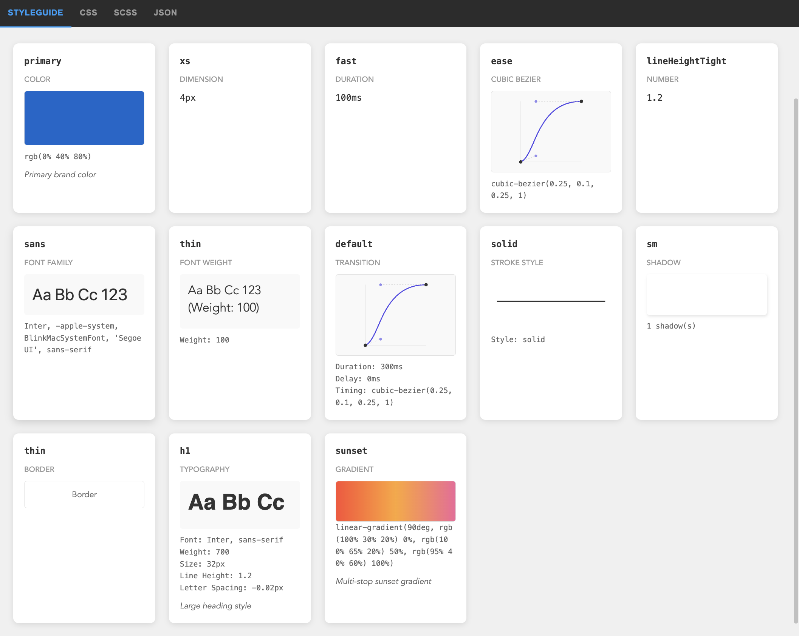

Working on a large project requires a systematic design approach to keep the user interface consistent. Often, this system is implemented as a set of pre-styled components or UI kits.

The smallest piece of a design system is a token: a color, size, or typography configuration reusable across different components. In UI kits, themes with dozens of values are similar to tokens. You can override a theme and have your components updated. However, once a project matures, the theme may contain hundreds of values, and without a strong system, they become unmanageable.

A few years ago, a community of designers and developers (Design Tokens Community Group or DTCG) decided to formalize how design tokens are defined and exchanged across tools and platforms. Recently, they released [a stable design tokens format specification](https://www.designtokens.org), with strict types and more unified (less CSS-like) definitions.

And I was very excited by how expressive it is compared to previous iterations and couldn't stop myself from creating an app around it. Especially since I have a lot of experience building UI for web at [Webstudio](https://webstudio.is) over the last three years and wanted to channel those ideas into something new.

It felt like a great opportunity to get better at design systems.

Using OpenCode for rapid prototyping and Svelte as a lightweight framework (already worked with it), I made a simple two-pane UI: a tokens tree on the left and generated CSS variables on the right. AI helps a ton with moving forward from "blank pages".

Tokens tree on the left is custom-built. I relied heavily on the [WAI-ARIA](https://www.w3.org/WAI/ARIA/apg/patterns/treeview/) recommendations and on Adam Argyle's advice to always support multi-select, based on his experience working on [VisBug](https://visbug.web.app/). Multi-select can be useful for bulk deleting or moving items into another folder with fewer repetitive actions.

While I was working on the prototype, Adam Argyle released a great new [color picker](https://github.com/argyleink/css-color-component) with all modern color spaces like OKLCH, LAB etc. supported in CSS. By the way, the design tokens specification relies on those exact color spaces for color tokens. Perfect timing.

Besides picking colors, I still needed a way to parse them and convert them to the DTCG color format, so I needed a solid library to avoid getting lost in color specifications. color-input uses the super cool [colorjs.io](https://colorjs.io) library. I've been hearing about it for years but never found it before, because I was spelling it wrong when searching :)

For UI components, I decided to go with HTML. Yeah, it got a lot of good stuff recently.

- Popover API for the app menu, adding tokens, and the token editor
- The dialog element for "About" info
- Invokers for declarative opening of dialogs and popovers
- Will definitely use interest invokers for tooltips

These are very easy to polyfill, except for anchor positioning, but I worked around that with a custom [floating-ui](https://github.com/floating-ui/floating-ui) setup.

Now we have a token editor and a CSS/JSON preview. That's useful for coding, but not for visual exploration.

What would be more helpful is an automatically generated style guide based on design tokens. All these values could be rendered as widgets and placed on a single page for designers to browse.

There's still room for improvement, though I already like the progress. Especially happy with the cubic-bezier preview, planning to reuse it for a bezier editor later.

What about AI? Can design tokens improve the results of generated websites and applications? Experience shows that the more specific your question is, the better the results you get. Design tokens could help a lot with this, and it may be interesting to explore later.

While researching I read a ton about design systems, especially recommend [Brad Frost's book and articles](https://bradfrost.com). That's where I learned how essential token aliasing is. One great concept is a 3-tier token architecture which defines arbitrary, semantic, and component values, where each layer maps to the next.

- Tier 1 tokens define all available values in the design system, such as color-blue-100 or color-white.
- Tier 2 tokens map Tier 1 tokens to semantic roles in the UI, for example text-color-primary or color-border-destructive.
- Tier 3 tokens are component-specific, such as button-bg-color or heading-text-color.

This component-specific tier can be leveraged even further by rendering a combination of these tokens as a component widget in Style Guide.

The design tokens specification offers a few options for this. One is the [token reference](https://www.designtokens.org/tr/2025.10/format/#references-and-json-pointer-integration) syntax (I use this one in the app), another uses [JSON Schema Pointer](https://www.designtokens.org/tr/2025.10/format/#json-pointer-support) (which I find trickier to represent in a UI).

By the way, I called this tool **Engramma**. I wanted an original name, so I borrowed it from one of my favorite games and used the Italian variant. You can check it out at [engramma.dev](https://engramma.dev).

From the start, the project has been completely open source, and I'm posting progress everywhere Reddit can't block me (yep, they're super unfriendly to new users). You can check it out on [GitHub](https://github.com/TrySound/engramma).

What's next? I'll keep improving the tool and start using it for new projects. Here are the closest ideas to implement:

- Themes and light/dark modes support based on "Resolver" specification that extends the DTCG format with "Sets" and "Modifiers" to partially override values while reusing others.
- Synchronize tokens with project code
- Explore integrations with external graphics editors and website builders

If you work with design systems, I'd love your feedback on Engramma—try it at [engramma.dev](https://engramma.dev), import your JSON with tokens, and tell me what's missing.

