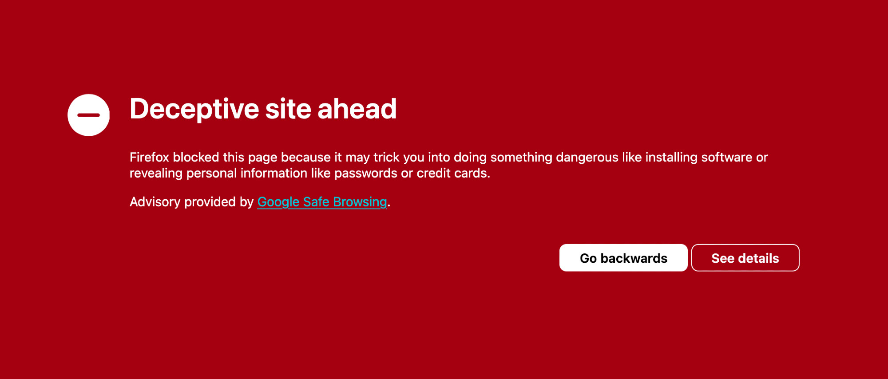
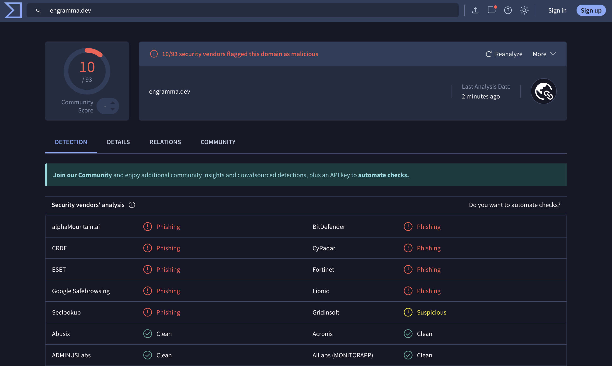
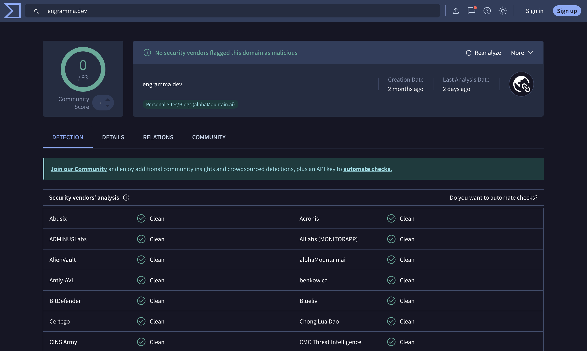

Friday evening is a great time for tinkering with a side project after a long week. You pour some tea, open your laptop and navigate to your project, only to find a red banner across whole app placed by the browser saying "Deceptive site ahead".

This happened with [Engramma](https://app.engramma.dev), my tool for editing JSON with design tokens. No phishing, no malware, only anonymous analytics.

## What Is Engramma?

I built [Engramma](https://app.engramma.dev) to explore better approaches for design systems and improves the experience of working with them. It's very much a work in progress with only a handful of users, so this warning felt especially surreal.

It made me wonder, how damaging would it be for an active business? A few hours of downtime costs real money. For me it costed only time.

## Fighting False Positives

### Google (2h)

As the banner suggested I checked the status in [Google Safe Browsing](https://transparencyreport.google.com), created an account at [Google Search Console](https://search.google.com/search-console), and verified domain ownership with a TXT record in DNS settings. The error message remained frustratingly vague, something about "detected phishing activity".

I submitted a review request with a brief clarification. Two hours later, an email arrived: the domain was cleared. The red banner vanished instantly.

_Phew._

Well, not quite. A deeper dive revealed the problem was far from over. A check on [VirusTotal](https://virustotal.com/) showed **10 different security vendors** had flagged the domain.

Google's warning might be gone, but security providers started warning users with their installed apps.

Now began the real work, contacting each vendor through web forms, forums, and support emails. Here's how they ranked from best to worst.

### CRDF (1 day)

CRDF maintains a dedicated false positives form requiring no account creation. I submitted details and received a response the next morning:

> We are pleased to inform you that the domain name 'engramma.dev' have been removed from our database.

### BitDefender (3 days)

BitDefender's support defaults to an AI bot that knows nothing. I immediately typed "human agent." The AI obliged, transferring me to a support representative who escalated to technicians.

Three days later:

> The initial detection was a false positive.

### alphaMountain.ai (4 days)

Account creation is required just to submit a report—an annoying friction layer when you're dealing with multiple vendors. I posted my case and waited.

Four days later:

> We have rescanned and reclassified the site. Our partner systems will be updated within 24 hours.

### Fortinet (4 days)

The most frustrating experience. Their automated "review" system confirmed the phishing classification after my first request. The submission form uses unintuitive categories that took multiple attempts. Eventually, I bypassed the form entirely and replied directly to one of their automated emails.

Result:

> Updated Category: Information Technology

Four days, multiple form submissions, and one firm email to escape the automation loop.

### CyRadar (6 days)

Their "Report False Positive" button redirects to Messages by Meta. I closed the tab immediately.

However, I found a contact email on their site. Six days later:

> Thanks for your response. We will reply you soon.

They never did. The flag disappeared eventually, though I received no confirmation.

### Seclookup (8 days)

First attempt early January, sent email. No response. Nothing.

Second attempt 8 days later. Thirty minutes later:

> This is an automated response to confirm that the following domains have been successfully whitelisted: engramma.dev, github.com

Apparently, their bot was on holiday. As a bonus they also whitelisted github.com, which I hadn't requested.

### ESET

Forum registration required. I created an account, posted my case, and... nothing. No confirmation email, no status update, no resolution notice. At some point, the flag simply disappeared. Ignorance is bliss, hah?

### Lionic

Web form only. No confirmation, no timeline, no transparency. The flag eventually cleared.

### Gridinsoft (16 days)

Gridinsoft was both first and last on my list. Their initial response:

> The current flagging of your domain is not based on a manual decision by our team. It originates from detections reported by multiple third-party security and reputation providers.

They cited VirusTotal and essentially said: "Go fix everyone else first."

So I did. I hunted down every vendor on that VirusTotal list, cleared them one by one, and returned two weeks later. This time, they performed a manual re-scan. The trust score finally updated.

## What Went Wrong

Three days after resolving the Google flag, Search Console sent another alert:

> Social engineering content detected on engramma.dev

Same cryptic error, zero explanation. I submitted another review request noting that the site contained no phishing content.

All got quiet. Then, a few days later, another identical flag.

Digging through Google forums, I found the most reported culprit: **302 temporary redirects**. I used one redirect (engramma.dev → app.engramma.dev) to avoid building a landing page. In addition to a newly registered domain, this looks like an obvious issue. Security systems flag such redirects because malicious actors use them extensively.

So I built a small landing page with the Engramma logo and an "Open Engramma" button. Submitted one final review.

A week later, everything cleared. Almost a month later, still no issues.

## Final thoughts

I always thought temporary redirect is a safe bet to avoid future issues with SEO but turns out can be damaging shot in the foot.

If you're launching on a fresh domain, monitor its status proactively. Check VirusTotal before launch. Set up Google Search Console immediately. One erroneous flag can spread like a virus across vendor databases.

Automated systems are causing real harm. "Request review" processes shouldn't require detective work to find contact forms, forum registrations, and email addresses. A 15-day resolution time for a false positive is unacceptable for businesses that depend on web traffic.

If something like this happens to you: don't panic, act fast. Hit their every channel, forms, emails, social links. Let them know.

_P.S._ During the entire time, Twitter blocked any posts containing the [engramma.dev](https://engramma.dev) domain. Good thing there are many other channels to share.
